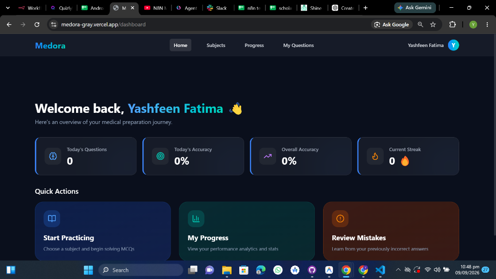
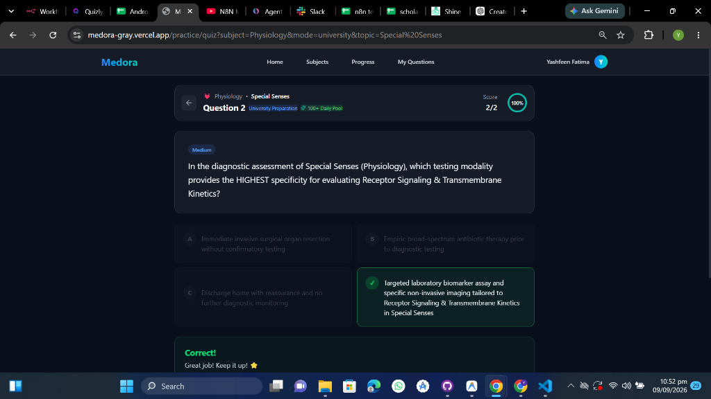
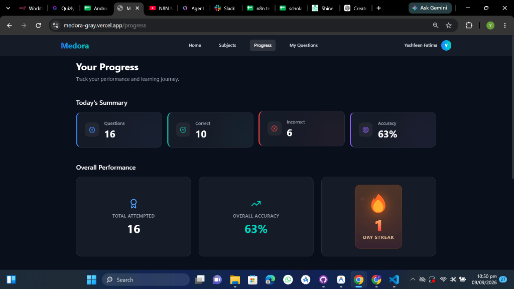

# 🩺 Medora — AI-Powered MBBS & USMLE MCQ Platform

<p align="center">
  
  
  
  
  
  
</p>

<p align="center">
  <strong>Medora</strong> is an AI-powered medical MCQ platform designed for students preparing for
  <strong>MBBS University Professional Examinations</strong> and
  <strong>USMLE Step 1 / Step 2 CK</strong>.
</p>

<p align="center">
  <a href="https://medora-gray.vercel.app/">🚀 Live Demo</a>
  &nbsp;•&nbsp;
  <a href="https://github.com/Yashfeen13/medora">💻 GitHub Repository</a>
</p>

---

## 🌟 Why Medora?

Medora is built to go beyond a traditional static question bank.

Instead of relying only on a fixed collection of repetitive questions, Medora combines **AI-powered question generation**, a **2D question-generation matrix**, intelligent **deduplication**, and **topic-specific daily pools** to create a more dynamic practice experience.

The platform is designed around a simple goal:

> **Study smarter. Practice better. Revise more effectively.**

### What makes Medora different?

* 🎯 Topic-specific daily MCQ pools
* 🤖 AI-powered question generation
* 🔬 Separate University and USMLE preparation modes
* 🔄 Dedicated mistake-practice system
* 🧠 Intelligent question deduplication
* 📊 Detailed performance analytics
* 🔊 Text-to-speech explanations
* 🎙️ Voice-based topic search
* 🌙 Modern dark medical glassmorphic interface
* 📱 Responsive experience across devices

---

# ✨ Key Features

## 🎯 1. 100+ Unique Daily MCQ Pool per Topic

Medora maintains separate daily question pools for individual subject-topic combinations.

Examples:

```text
Physiology
└── Blood

Anatomy
└── Head & Neck

Pharmacology
└── Autonomic Nervous System
```

Each topic is designed around a **100+ question daily pool**, giving students a large amount of fresh practice material.

A visible:

```text
100+ Daily Pool
```

badge communicates the availability of the daily practice pool within the quiz experience.

---

# 🔬 2. Dual Preparation Modes

Medora provides two clearly separated preparation modes.

### 🎓 University Preparation

Designed around academic and professional university examinations.

Focus areas include:

* Core theoretical concepts
* Anatomical structures
* Physiological mechanisms
* Important definitions
* Direct high-yield concepts
* Academic examination-style questions

### 🇺🇸 USMLE Preparation

Designed around clinical reasoning and application.

Focus areas include:

* Clinical vignettes
* Patient presentations
* Laboratory interpretation
* Diagnosis
* Pathophysiology
* Multi-step clinical reasoning

### Strict Mode Separation

Questions are generated and organized according to the selected preparation mode so that **University and USMLE practice remain conceptually separated**.

---

# 🔄 3. Practice My Mistakes

One of Medora's core learning features is the **Practice My Mistakes** system.

Whenever a student answers a question incorrectly, the question becomes part of their active mistake pool.

Students can then return to these questions and practice specifically on the concepts they struggled with.

### Real-Time Mistake Resolution

When a previously incorrect question is answered correctly:

```text
Incorrect Question
       ↓
Practice Again
       ↓
Correct Answer
       ↓
Question Resolved
       ↓
Incorrect Count ↓ 1
```

The resolved question is removed from the student's active mistake set.

This creates a focused learning loop:

```text
Attempt
   ↓
Identify Weakness
   ↓
Practice Mistake
   ↓
Correct It
   ↓
Improve Performance
```

---

# 🧠 4. Intelligent Question Deduplication

Medora uses a custom deduplication engine to minimize duplicate and highly similar questions.

The system incorporates:

* Text normalization
* Word-overlap comparison
* Jaccard similarity
* Fingerprinting
* Similarity thresholding

The current implementation uses a similarity threshold of approximately **85%** for rejecting substantially similar questions.

This helps prevent situations where students repeatedly encounter essentially the same question with only minor wording changes.

### Example

```text
Question A
"What is the main function of the sinoatrial node?"

Question B
"Which structure acts as the primary pacemaker of the heart?"
```

Although the wording differs, the system can identify high semantic/word overlap patterns and avoid unnecessary duplication where appropriate.

---

# 📊 5. Comprehensive Analytics & Progress Tracking

Medora tracks learning activity and converts it into useful performance insights.

### Daily Performance

Students can view:

* Questions attempted
* Correct answers
* Incorrect answers
* Accuracy percentage
* Daily activity

### 🔥 Study Streak

Medora tracks consecutive study activity and displays a study streak to encourage consistency.

### 📚 Subject-Wise Performance

Performance can be broken down across the supported medical subjects to help students identify their strongest and weakest areas.

Example:

```text
Anatomy         █████████░  90%
Physiology      ████████░░  82%
Pathology       ███████░░░  74%
Pharmacology    ██████░░░░  65%
```

### Local Storage + Cloud Support

The application can maintain progress through client-side storage, with optional Supabase-backed synchronization depending on the deployment configuration.

---

# 🔊 6. Text-to-Speech & Voice Features

## 🔊 Medical Explanation TTS

Medora includes a text-to-speech experience that allows students to listen to explanations and concept clarifications.

This can be especially useful for:

* Revision
* Hands-free learning
* Listening while travelling
* Reinforcing difficult concepts

## 🎙️ Voice Topic Search

The platform also supports speech-to-text input for topic searching.

Instead of typing:

```text
"Autonomic Nervous System"
```

a student can use the microphone and search through voice input.

---

# 🌙 7. Premium Dark Medical UI

Medora uses a modern dark medical interface designed to provide a focused study experience.

### Design Characteristics

* Dark glassmorphic cards
* Inter typography
* Medical blue/cyan accents
* Smooth CSS animations
* High-contrast question cards
* Responsive layouts
* Clear answer states
* Minimal visual distractions

### Primary Theme

```text
Background:  #0A0F1C
Blue:        #3B82F6
Teal:        #14B8A6
```

The goal is to create an interface that feels closer to a modern product than a traditional educational portal.

---

# 📚 Supported MBBS Subjects

Medora currently supports **19 medical subjects** across the major stages of the MBBS curriculum.

| Phase             | Subjects                                                                                                                                                |
| ----------------- | ------------------------------------------------------------------------------------------------------------------------------------------------------- |
| **Pre-Clinical**  | Anatomy, Physiology, Biochemistry                                                                                                                       |
| **Para-Clinical** | Pathology, Microbiology, Pharmacology, Forensic Medicine, Community Medicine                                                                            |
| **Clinical**      | General Medicine, General Surgery, Obstetrics & Gynecology, Pediatrics, Ophthalmology, ENT, Orthopedics, Dermatology, Psychiatry, Radiology, Anesthesia |

---

# 🌐 Live Demo

<p align="center">

### 🚀 Try Medora

**https://medora-gray.vercel.app/**

</p>

---

# 🏗️ Architecture

Medora combines a modern frontend, API routes, database services, and AI-powered question generation.

```text
                         ┌───────────────────┐
                         │      Student      │
                         └─────────┬─────────┘
                                   │
                                   ▼
                         ┌───────────────────┐
                         │     Medora UI     │
                         │ Next.js + React   │
                         └─────────┬─────────┘
                                   │
                         ┌─────────┴─────────┐
                         │                   │
                         ▼                   ▼
                 ┌──────────────┐    ┌───────────────┐
                 │   API Layer  │    │  AI Engine    │
                 │ Next.js API  │    │ Gemini / LLM  │
                 └──────┬───────┘    └───────┬───────┘
                        │                    │
                        ▼                    ▼
                 ┌──────────────┐    ┌───────────────┐
                 │   Supabase   │    │ Question      │
                 │ PostgreSQL   │    │ Generation    │
                 └──────┬───────┘    └───────┬───────┘
                        │                    │
                        └─────────┬──────────┘
                                  ▼
                         ┌───────────────────┐
                         │   MCQ Experience  │
                         │ + Progress Data   │
                         └───────────────────┘
```

---

# 🛠️ Tech Stack

| Category               | Technology                          |
| ---------------------- | ----------------------------------- |
| Frontend Framework     | Next.js 16.3                        |
| UI Library             | React 19                            |
| Language               | TypeScript 5                        |
| Styling                | Tailwind CSS v4                     |
| Icons                  | Lucide                              |
| AI                     | Google Gemini                       |
| Database               | Supabase PostgreSQL                 |
| Database Client        | `@supabase/supabase-js`             |
| Question Deduplication | Jaccard Similarity                  |
| Question Generation    | 2D Sub-Concept × Focus Angle Matrix |
| Hosting                | Vercel                              |
| Version Control        | Git + GitHub                        |

---

# ⚙️ Core Engineering Concepts

## 1. 2D Question Generation Matrix

Medora uses a procedural fallback question-generation approach based on a matrix of:

```text
Sub-Concept
     ×
Focus Angle
```

For example:

```text
Sub-Concept                Focus Angle
────────────────────────────────────────────
Cardiac Cycle       ×      Mechanism
Cardiac Cycle       ×      Clinical Significance
Cardiac Cycle       ×      Timing
Cardiac Cycle       ×      Physiology
```

Combining multiple sub-concepts with multiple focus angles creates a larger space of possible questions.

---

## 2. Question Deduplication Pipeline

The deduplication pipeline can be represented as:

```text
Generated Question
       ↓
Text Normalization
       ↓
Tokenization
       ↓
Similarity Calculation
       ↓
Jaccard Score
       ↓
Similarity Threshold
       ↓
┌─────────────────┬──────────────────┐
│ Similar         │ Sufficiently New │
│      ❌         │        ✅        │
└─────────────────┴──────────────────┘
                      ↓
                Add to Pool
```

The goal is to maximize question diversity while minimizing repetition.

---

# 📁 Project Structure

```text
Medora/
│
├── src/
│   │
│   ├── app/
│   │   ├── api/
│   │   │   ├── attempts/
│   │   │   ├── questions/
│   │   │   ├── progress/
│   │   │   └── users/
│   │   │
│   │   ├── dashboard/
│   │   │   └── ...
│   │   │
│   │   ├── practice/
│   │   │   ├── mode/
│   │   │   ├── topic/
│   │   │   └── quiz/
│   │   │
│   │   ├── progress/
│   │   │   └── ...
│   │   │
│   │   ├── questions/
│   │   │   └── ...
│   │   │
│   │   ├── subjects/
│   │   │   └── ...
│   │   │
│   │   └── page.tsx
│   │
│   ├── components/
│   │   ├── layout/
│   │   ├── progress/
│   │   ├── quiz/
│   │   ├── subjects/
│   │   └── ui/
│   │
│   └── lib/
│       ├── constants.ts
│       ├── daily-pool.ts
│       ├── fallback-questions.ts
│       ├── gemini.ts
│       └── user.ts
│
├── public/
│   └── screenshots/
│
├── package.json
├── .gitignore
├── README.md
└── ...
```

---

# 📸 Screenshots & Interface Tour

Add your actual screenshots to the `public/screenshots/` directory and update the paths below.

## Dashboard

<p align="center">
  
</p>

**Dashboard & Analytics**

The dashboard provides a central overview of study activity, accuracy, streaks, and progress.

---

## Quiz Interface

<p align="center">
  
</p>

**Dynamic Quiz Engine**

The quiz interface provides MCQ practice, answer feedback, explanations, and the daily-pool status.

---

## Practice My Mistakes

<p align="center">
  
</p>

**Targeted Mistake Practice**

Students can revisit questions they previously answered incorrectly.

---

## Progress Breakdown

<p align="center">
  
</p>

**Subject-wise Performance Metrics**

Performance analytics help students identify areas requiring additional revision.

---

# 🚀 Quick Start

## Prerequisites

Make sure the following are installed:

* Node.js **18+**
* npm **9+**
* Git

---

## 1. Clone the Repository

```bash
git clone https://github.com/Yashfeen13/medora.git
cd medora
```

---

## 2. Install Dependencies

```bash
npm install
```

---

## 3. Configure Environment Variables

Create a `.env.local` file in the project root:

```env
NEXT_PUBLIC_SUPABASE_URL=your_supabase_url
NEXT_PUBLIC_SUPABASE_ANON_KEY=your_supabase_anon_key
GEMINI_API_KEY=your_gemini_api_key
```

> Never commit `.env.local` or private API keys to GitHub.

---

## 4. Run the Development Server

```bash
npm run dev
```

Open:

```text
http://localhost:3000
```

---

# 🚀 Deploying to Vercel

Medora is designed for straightforward deployment through Vercel.

### Deployment Steps

```text
GitHub Repository
       ↓
Import into Vercel
       ↓
Configure Environment Variables
       ↓
Build
       ↓
Deploy
       ↓
Production
```

### Manual Deployment

1. Push the project to GitHub.
2. Open Vercel.
3. Select **Add New → Project**.
4. Import the `medora` repository.
5. Configure the required environment variables.
6. Deploy.

---

# 🔐 Security

Never expose private credentials in source code.

Sensitive values should remain in environment variables:

```text
.env.local
```

Make sure it is included in `.gitignore`.

Example:

```gitignore
.env
.env.local
.env.*.local
```

---

# 🧪 Testing Checklist

Before deploying a new version, verify the following:

### MCQ Engine

```text
[ ] Questions load correctly
[ ] Options display correctly
[ ] Correct answer is evaluated
[ ] Incorrect answer is handled
[ ] Explanation appears correctly
```

### Preparation Modes

```text
[ ] University mode works
[ ] USMLE mode works
[ ] Questions remain separated between modes
```

### Daily Pool

```text
[ ] Daily pool initializes
[ ] Questions are unique
[ ] Duplicate detection works
[ ] Pool count is displayed correctly
```

### Mistake Practice

```text
[ ] Incorrect questions are stored
[ ] Practice My Mistakes loads correctly
[ ] Correctly resolved questions are removed
[ ] Incorrect count updates in real time
```

### Analytics

```text
[ ] Daily statistics update
[ ] Accuracy updates
[ ] Streak updates
[ ] Subject performance updates
```

### AI

```text
[ ] AI requests succeed
[ ] Generated MCQs are parsed
[ ] Invalid AI responses are handled
[ ] API errors do not crash the application
```

---

# 🧠 Example AI Question Workflow

A typical AI-generated MCQ request can be structured around the student's selected parameters:

```text
Preparation Mode:
USMLE

Subject:
Physiology

Topic:
Cardiovascular System

Difficulty:
Medium
```

The system can then construct a structured generation prompt:

```text
Generate a medical MCQ.

Preparation Mode: USMLE
Subject: Physiology
Topic: Cardiovascular System
Difficulty: Medium

Requirements:
- Four answer options
- One correct answer
- Clinically relevant reasoning
- Clear explanation
- No ambiguous wording
- Medically coherent content
```

The generated response is then processed and presented through the Medora quiz interface.

---

# 🛡️ Medical Content Disclaimer

Medora is an **educational software project** designed for medical examination preparation.

It does not provide:

* Medical diagnosis
* Medical treatment
* Personalized medical advice
* Emergency medical guidance

AI-generated questions and explanations may contain inaccuracies and should be verified against authoritative medical textbooks, university resources, and official examination materials.

---

# 📈 Future Roadmap

## Phase 1 — Core Platform

* ✅ MBBS subject structure
* ✅ Topic-based practice
* ✅ University preparation mode
* ✅ USMLE preparation mode
* ✅ MCQ engine
* ✅ Daily question pool
* ✅ Deduplication
* ✅ Mistake practice
* ✅ Analytics
* ✅ AI integration
* ✅ Vercel deployment

---

## Phase 2 — Personalization

* ⬜ User accounts
* ⬜ Cloud-synced profiles
* ⬜ Personalized dashboards
* ⬜ Weak-topic detection
* ⬜ Personalized question recommendations
* ⬜ Study history

---

## Phase 3 — Advanced Learning

* ⬜ Adaptive difficulty
* ⬜ Spaced repetition
* ⬜ Daily challenges
* ⬜ Streak rewards
* ⬜ Leaderboards
* ⬜ Advanced performance analytics

---

## Phase 4 — AI Tutor

* ⬜ Conversational AI medical tutor
* ⬜ Follow-up explanations
* ⬜ Concept simplification
* ⬜ "Why is this answer correct?"
* ⬜ "Why are the other options wrong?"
* ⬜ Personalized revision assistance

---

## Phase 5 — Mobile Application

* ⬜ Flutter mobile application
* ⬜ Offline question practice
* ⬜ Push notifications
* ⬜ Daily revision reminders
* ⬜ Mobile-first analytics
* ⬜ Cross-platform synchronization

---

# 💡 Project Highlights

Medora demonstrates practical experience in several areas of modern software engineering:

```text
Full-Stack Development
        +
AI Integration
        +
Prompt Engineering
        +
Database Design
        +
Algorithmic Deduplication
        +
Procedural Content Generation
        +
Analytics
        +
Responsive UI/UX
        +
Cloud Deployment
```

The project is particularly focused on solving a real-world educational problem:

> **How can medical students practice more questions while reducing unnecessary repetition and improving revision efficiency?**

---

# 🎯 What Medora Demonstrates

### Technical Skills

* Next.js
* React
* TypeScript
* Tailwind CSS
* PostgreSQL
* Supabase
* REST/API development
* AI API integration
* Prompt engineering
* Algorithmic similarity detection
* Local storage
* Cloud deployment
* Git/GitHub

### Software Engineering Concepts

* Component-based architecture
* Modular application structure
* Database-driven systems
* API integration
* State management
* Error handling
* Responsive design
* Performance-oriented UI design
* Production deployment

---

# 👩‍💻 Developer

## Yashfeen Fatima

**BS Computer Science**
**COMSATS University, Sahiwal Campus**

### Areas of Interest

* 📱 Flutter & Mobile Application Development
* 🤖 Artificial Intelligence
* 🧠 Generative AI
* 🔎 RAG Systems
* 🌐 Full-Stack Development
* 🗄️ Database Systems
* ☁️ Cloud Deployment

Medora represents an application of these technologies to a real educational use case.

---

# ⭐ Support

If you find Medora useful or interesting:

* ⭐ Star the repository
* 🍴 Fork the project
* 🐛 Report bugs
* 💡 Suggest improvements
* 🔧 Submit pull requests

---

# 🤝 Contributing

Contributions are welcome.

```bash
git clone https://github.com/Yashfeen13/medora.git

cd medora

git checkout -b feature/your-feature

git add .

git commit -m "Add your feature"

git push origin feature/your-feature
```

Then open a Pull Request on GitHub.

---

# 📄 License

This project is licensed under the **MIT License**.

See the `LICENSE` file for more information.

---

<p align="center">

# 🩺 Medora

### Study Smarter. Practice Better. Prepare with Confidence.

Built with ❤️, ☕ and AI.

</p>
